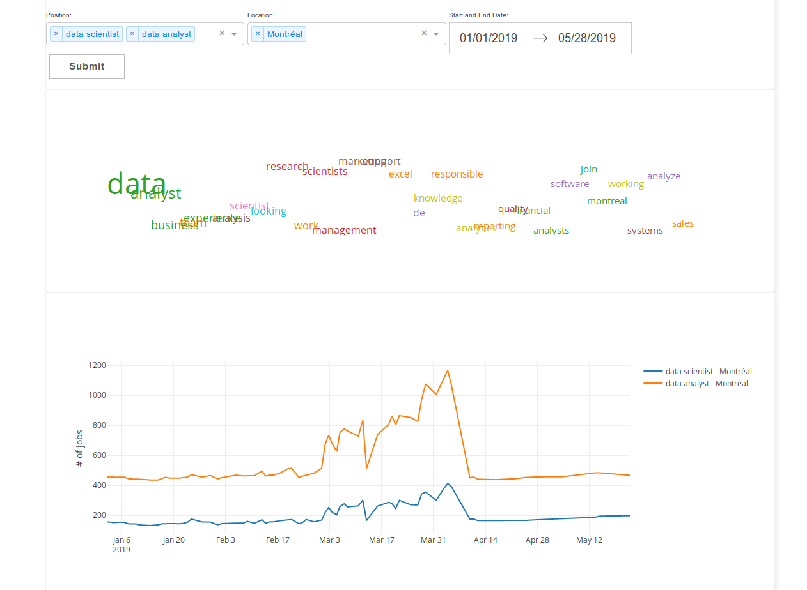
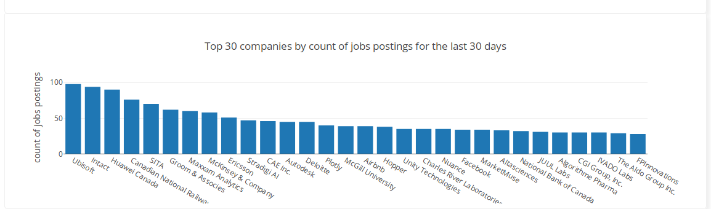

### Project description:
Looking for a job as a data analyst or data scientist, I wanted to get a better idea of the job market
for these two positions in Montreal, Qc.
  * I used a web scraper script (scrape_jobs.py) to fetch various jobs posting info and do basic processing data
from a very popular jobs aggregator website and store these info into a MySQL database on AWS (RDS).
For now, this script has to be run manually every day but we could automate the daily scraping with a basic cronjob on a remote server/instance.
  * On the visualisation side, I used the excellent Dash library from Plotly as an open source tool to visualize data.
As the Dash app is based on Flask, some knowledge about flask framework were required.

    To display data, some processing is done between the database query and the various visualisations, pandas, dask, and nltk (word cloud) packages were of great help.
The use of nltk make the dashboard a bit slow to load at start as Dash do all the data processing and load necessary data for the dashboard in memory.
The dashboard is not refreshed automatically with new daily data as this is one limitation from plotly similarly as Tableau or other BI tools, Dash does not allow
data streaming out of the box, but the use of Redis or other strategies could allow to achieve this result if necessary.

Some future improvements at various levels can be done:
  *   Port the mutipage dash app to a more classic flask app, allowing web development of other pages easily while keeping the dashboards.
  *   Adding some other visualisations to the jobs dashboard, like gauge for variations for week to week for instance.
  *   Improve the word cloud display, both on processing and visual, while I wanted to be able to make the filters interactive with the word cloud, this make the app very slow to load
as some data (basic nlp with nltk) processing is happening behind the scene. Also, a decicated word cloud dash component can be improved with a react component that has yet to be develop by the Dash community.

Here are some captures from the dashboard:

